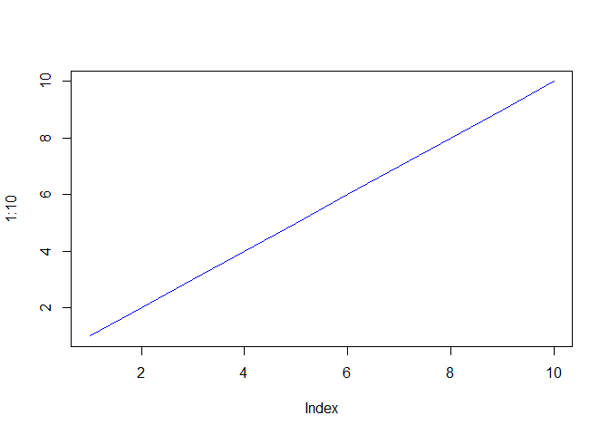

class 06 r function
================

\#\#about this is my **class 6** r markdown document with code and notes

``` r
plot(1:10, typ="l", col="blue")
```

<!-- -->

\#read the txt files called test

``` r
read.table("test1.txt", header=TRUE, sep=",")
```

    ##   Col1 Col2 Col3
    ## 1    1    2    3
    ## 2    4    5    6
    ## 3    7    8    9
    ## 4    a    b    c

``` r
read.table("test2.txt", header=TRUE, sep="$")
```

    ##   Col1 Col2 Col3
    ## 1    1    2    3
    ## 2    4    5    6
    ## 3    7    8    9
    ## 4    a    b    c

``` r
read.table("test3.txt", header=F, sep="")
```

    ##   V1 V2 V3
    ## 1  1  6  a
    ## 2  2  7  b
    ## 3  3  8  c
    ## 4  4  9  d
    ## 5  5 10  e

\#our first silly function example

``` r
add <- function(x, y=1) {
# Sum the input x and y
x + y
}
```

``` r
add(x=1, y=4)
```

    ## [1] 5

add(1, 4) add(1) \#that one will give error add( c(1, 2, 3) ) \#? add(
c(1, 2, 3), 4 ) add(1, 2, 2) add(x=1, y=“b”) \#\# You need a “name”,
“arguments” and “body”…

``` r
rescale <- function(x) {
rng <-range(x)
(x - rng[1]) / (rng[2] - rng[1])
}
```

# Test on a small example where you know the answer

rescale(1:10)

``` r
rescale(1:10)
```

    ##  [1] 0.0000000 0.1111111 0.2222222 0.3333333 0.4444444 0.5555556 0.6666667
    ##  [8] 0.7777778 0.8888889 1.0000000

\#na.rm = true change ot and that was about the range r values argumeht
\#should then give anwsers 1 and 10

``` r
rescale3 <- function(x, na.rm=TRUE, plot=FALSE) {
rng <-range(x, na.rm=na.rm)
print("Hello")
answer <- (x - rng[1]) / (rng[2] - rng[1])
print("is it me you are looking for?")
if(plot) {
plot(answer, typ="b", lwd=4)
}
print("I can see it in ...")
return(answer)
}
```
